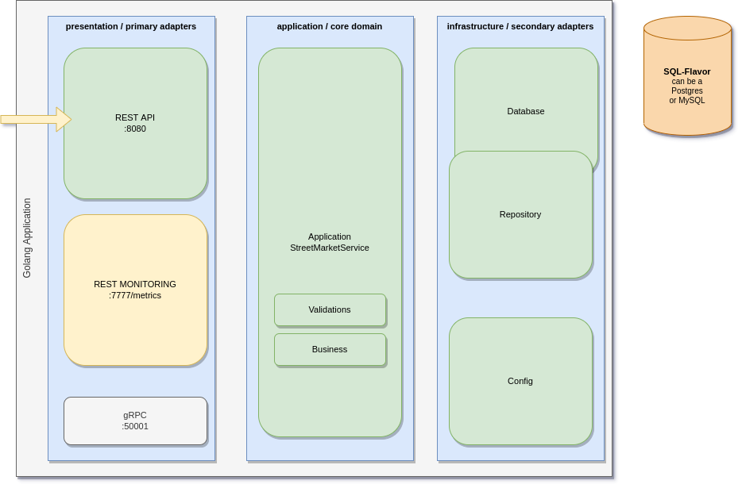

# StreetMarket Service

To **Run All** Tests, Coverage, Database Loader and Application, execute into your terminal:  
`./scripts/run.sh`    

After run, you can use API:


# Architecture
The application follows the Hexagonal Architecture to keep intput/output flows organized and DDD is the main guide to core domain.
  
## Internal Organization
Simple follows the architecture described above, combined with, the recommended [Go Project Layout](https://github.com/golang-standards/project-layout).  
Highlights to:  
- `presentation`: is the **primary adapter** (REST, gRPC, Prometheus exposing, etc)
- `application`: holds the **core domain** (based on DDD)
- `infrastructure`: resposible for **secondary adapters** (Databases, Mail Relays, Notifications, etc)



# API Calls Example
```sh
curl -X GET -s localhost:8080/v1/streetmarket/ -d '{"id": 100}'

curl -X POST -s localhost:8080/v1/streetmarket/ -d '{"long": 657881, "lat": -657881, "sector": 5001, "area": 99, "dist_code": 458, "district": "MOEMA", "subtown_code": 546, "subtown": "VILA MARIANA", "region_5": "SUL", "region_8": "SUL B", "name": "FEIRA DO IBIRAPUERA", "registry": "1869-X", "addr": "AV IBIRAPUERA", "number": "1800", "neighborhood": "AV BRASIL", "reference": "PQ DO IBIRAPUERA"}' 

curl -X POST -s localhost:8080/v1/streetmarket/query/ -d '{"name": "IBIR"}'

curl -X POST -s localhost:8080/v1/streetmarket/query/ -d '{"name": "IBIR"}'

curl -X DELETE -s localhost:8080/v1/streetmarket/ -d '{"id": 1}'
```
# Next Steps
1. Set database specific schema
2. Expose Prometheus metrics
3. Evaluate GORM tradeoffs
